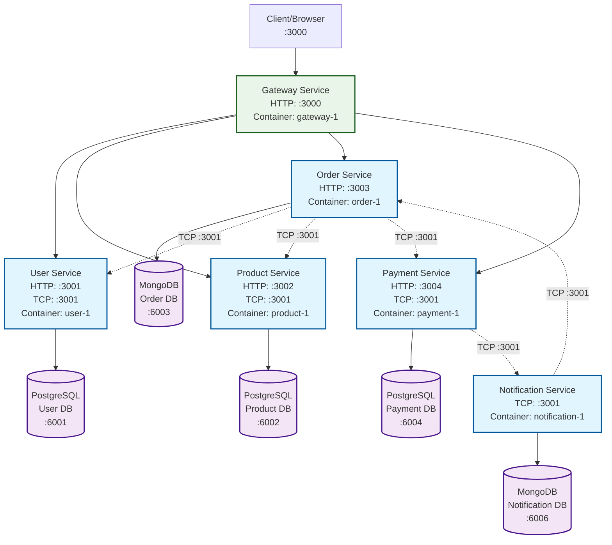

# NestJS Delivery System Architecture

## Port Mapping Summary

### External Ports (Host → Container)
- **Gateway**: 3000:3000 (HTTP)
- **User**: 3001:3000 (HTTP)
- **Product**: 3002:3000 (HTTP)
- **Order**: 3003:3000 (HTTP)
- **Payment**: 3004:3000 (HTTP)
- **Notification**: No external HTTP port

### Database Ports (Host → Container)
- **PostgreSQL (User)**: 6001:5432
- **PostgreSQL (Product)**: 6002:5432
- **MongoDB (Order)**: 6003:27017
- **PostgreSQL (Payment)**: 6004:5432
- **MongoDB (Notification)**: 6006:27017

### Internal TCP Communication Ports
- **User Service**: TCP :3001
- **Product Service**: TCP :3001
- **Payment Service**: TCP :3001
- **Notification Service**: TCP :3001

## Service Communication Flow

1. **Client** → **Gateway** (HTTP :3000)
2. **Gateway** → **Microservices** (HTTP :300x)
3. **Microservices** ↔ **Microservices** (TCP :3001)
4. **Microservices** → **Databases** (Internal container network)

## Technology Stack

- **API Gateway**: NestJS HTTP
- **Microservices**: NestJS with TCP transport
- **Databases**: PostgreSQL, MongoDB
- **Containerization**: Docker & Docker Compose
- **Authentication**: JWT (User Service)
- **Validation**: Joi, class-validator
